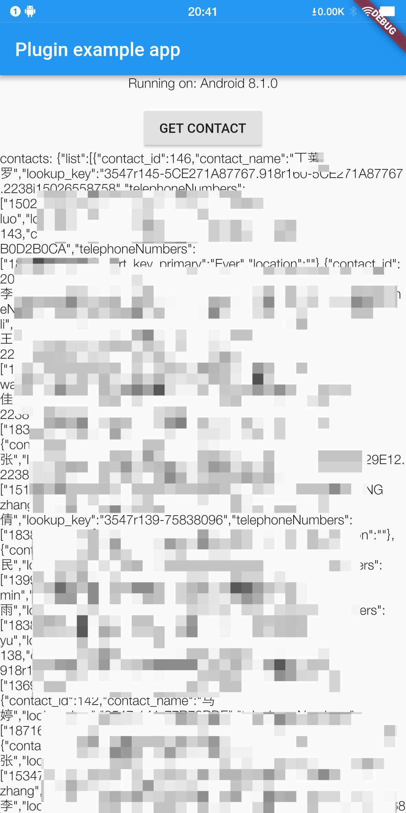
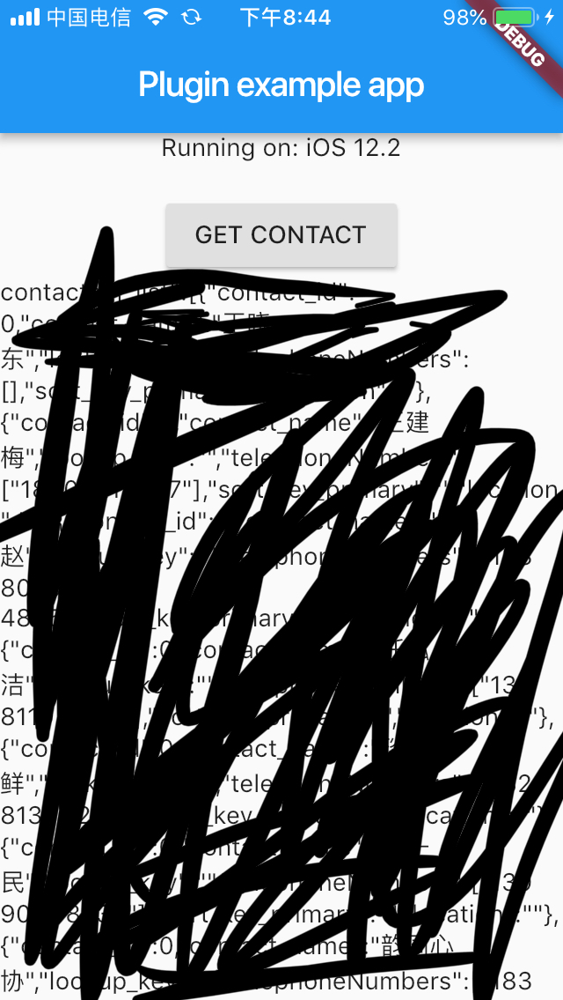

# phone_contact

Flutter plugin for get contact info.

## Installation

First, add `phone_contact` as a [dependency in your pubspec.yaml file](https://flutter.io/platform-plugins/).

```dependencies:
        phone_contact:
             git:
              url: "https://github.com/Wongxd/flutter_plugin_contact.git"

```

### iOS

Add the following keys to your _Info.plist_ file, located in `<project root>/ios/Runner/Info.plist`:

- `NSContactsUsageDescription` - describe why your app needs permission for the contacts library.

### Android

```
<uses-permission android:name="android.permission.READ_CALL_LOG" />
<uses-permission android:name="android.permission.WRITE_CALL_LOG" />
<uses-permission android:name="android.permission.READ_CONTACTS" />
<uses-permission android:name="android.permission.WRITE_CONTACTS"/>
```

### Example

```dart
import 'package:phone_contact/phone_contact.dart';

 var temp = PhoneContact.getContactList();
                    temp.then((it) {
                      if (it is ContactListBean) {
                        setState(() {
                          contactStr = jsonEncode(it);
                        });
                      }
```

####Android


<br/>

####iOS

